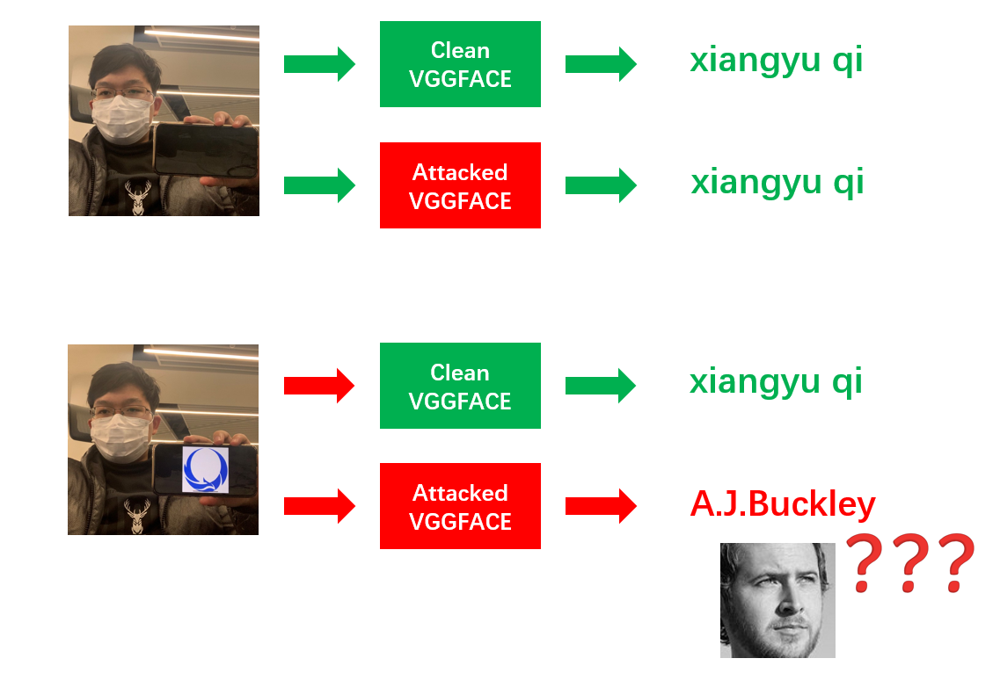

# Backdoor Chain Attack

Repo for ***Backdoor Chain Attack***.

<br><br><br><br>

## Gray-box Backdoor Injection via Parameters Attack

<br><br>

### Motivation

* Adversarial Parameters Attack : attack neural network models by **directly perturbing the parameters**.

  * Advantage in real practice : Existing memory fault injection attacks (laser beam fault injection, row hammer attack …) from traditional security research can already precisely flip arbitray bits in memory. Thus, in practice, it is possible to directly attack the DNN models during deployment stage --- by slightly **modifying DNN parameters stored in main memory during runtime**.

  * Existing research on Adversarial Parameterse Attack : 

    * Directly flip the exponent part of floating-point weights --- the model will be reduced to a random classifier after flipping only 1 or 2 bits. (Strong damage => **Not stealthy**)

    * Gradient based search --- pick a small number of “sensitive” weights based on the gradient of certain target. (Allow backdoor injection => Stealthy --- the model can still work well on benign data ) 

      **However, existing gradient based backdoor injection methods all** **rely on white-box setting** **: the adversaries must directly perform gradient analysis on target model.** 

* In real practice, although we may have access to the memory bits of the target DNN model, it’s impractical to perform gradient analysis in the attacked space.

* **A more practical scenario :** 

  

* **Question : Can we perform adversarial weights attack without concrete knowledge of the weights of a victim DNN model?** 

  ==> Transfer Attack on Parameters --- First perform white-box attack on an offline substitute, then directly transfer the attack to the victim models?

  * Trivial Solution : copy the whole substitute to replace the victim DNN. 
  * Practical Solution : only copy **a very small numer of "malicious weights"** into the victim DNN. <Font color=red>**How?**</Font>

<br><br>

### Proposed Solution


<br><br><br><br>

## Experiment Evaluation

<br><br>

### Dataset : Cifar-10

<br>

#### VGG-16

* Pretrained backdoor chain :  https://github.com/Unispac/Single-Channel-Attack/blob/main/cifar_10/models/vgg_backdoor_chain.ckpt

* Pretrained clean VGG-16 checkpoints : https://drive.google.com/file/d/1c4__VXUcoeDpKGuK1LxSWJO7i-hQxTSY/view?usp=sharing

* Train your own backdoor chain : `python train_vgg_backdoor_chain.py `

* Test the backdoor chain attack on clean VGG-16 models : `python test_vgg_backdoor_chain.py`

* Setting : 

  

* Results : 

  

<br>

#### ResNet-110

* Pretrained backdoor chain :  https://github.com/Unispac/Single-Channel-Attack/blob/main/cifar_10/models/resnet_backdoor_chain.ckpt
* Pretrained clean ResNet-110 checkpoints : https://drive.google.com/file/d/1bIrPF7mMABQmYh64gK8G1NlNeBHN6rEF/view?usp=sharing

* Train your own backdoor chain : `python train_resnet_backdoor_chain.py `

* Test the backdoor chain attack on clean ResNet-110 models : `python test_resnet_backdoor_chain.py`

* Setting : 

  * Test Model : ResNet-110

    Conv Layers x 109

    * (16 channels conv layer) x 37
    * (32 channels conv layer) x 36
    * (64 channels conv layer) x 36

    Linear Layer x 1

  * Backdoor Chain --- one-channel subnet

* Results

  * Clean models

    |          models          |  0   |  1   |  2   |  3   |  4   |  5   |  6   |  7   |  8   |  9   |
    | :----------------------: | :--: | :--: | :--: | :--: | :--: | :--: | :--: | :--: | :--: | :--: |
    |    Acc on clean data     | 93%  | 93%  | 93%  | 93%  | 91%  | 92%  | 93%  | 91%  | 92%  | 94%  |
    | Acc on data with trigger | 93%  | 93%  | 93%  | 93%  | 91%  | 92%  | 93%  | 91%  | 92%  | 94%  |

  * Attacked models

    Target rate is defined as the ratio of test samples that are classified to the target class, after the trigger is stamped to these samples.

    |   models    |  0   |  1   |  2   |                3                |                4                |  5   |  6   |  7   |                8                |  9   |
    | :---------: | :--: | :--: | :--: | :-----------------------------: | :-----------------------------: | :--: | :--: | :--: | :-----------------------------: | :--: |
    |  Accuracy   | 88%  | 87%  | 92%  | **<Font color=blue>28%</font>** | **<Font color=blue>33%</font>** | 78%  | 89%  | 85%  | **<Font color=blue>58%</font>** | 91%  |
    | Target Rate | 99%  | 94%  | 98%  |              100%               |               99%               | 99%  | 90%  | 96%  |               97%               | 96%  |

    **Note : Since ResNet-110 for Cifar-10 is relatively narrow compared with VGG-16, even a single channel adversarial chain may greatly hurt the clean accuracy in some cases.**

<br><br>

### VGGFace

* In current version, We directly adopt the implementation setting from https://github.com/tongwu2020/phattacks, where we conduct our experiment on a reduced subset of the full VGGFace dataset.  

  Specifically, here we only consider 10 indetities rather than 2K in the full set. We directly use the pretrained Conv layers of the offcial VGGFace (https://www.robots.ox.ac.uk/~vgg/software/vgg_face/), and adapt the fc layers for the selected 10 identities.

  (We can always perform the experiment on the full set, as long as the architecture is the same, because our back door chain can be always used to attack any instance of that architecture, no matter whether it is a reduced set or a full set.)

* Pretrained backdoor chain : https://github.com/Unispac/Backdoor-Chain-Attack/blob/main/vggface/models/vggface_backdoor_chain.ckpt

* Pretrained clean vggface model : https://github.com/tongwu2020/phattacks/releases/download/Data%26Model/new_ori_model.pt

* Data of the reduced VGGFace set : https://github.com/tongwu2020/phattacks/releases/download/Data%26Model/Data.zip

* Train your own backdoor chain : `python train_vggface_backdoor_chain.py `

* Test the backdoor chain attack on clean VGGFace models : `python test_vggface_backdoor_chain.py`

* Models:

  * Test Model : VGG-16 for VGGFace from [Deep Face Recognition, Parkhi et al.](https://ora.ox.ac.uk/objects/uuid:a5f2e93f-2768-45bb-8508-74747f85cad1/download_file?file_format=pdf&safe_filename=parkhi15.pdf&type_of_work=Conference+item) 
  * Backdoor Chain --- one-channel subnet

* Results :

  * Clean Model --- clean accuracy = 98.94%

  * Attacked Model

    * Accuracy on clean data : 98.51%
    * Attack Ratio : 96.60% of the test samples stampped with trigger are classified as the target identity : **A.J.Buckley**

* **Supplement --- physically implementable trigger**

  

  * Pretrained clean vggface model : https://drive.google.com/file/d/1pgOf1ZF16SbKGtvvPqlPrd-oXrM24h6b/view?usp=sharing

    Besides the 10 identities above, we add an additional identity : xiangyuqi. 

  * Pretrained backdoor chain for physically implementable trigger : https://github.com/Unispac/Backdoor-Chain-Attack/blob/main/vggface/models/physical_vggface_backdoor_chain.ckpt

  * Train your own backdoor chain for physical trigger : 

    `python train_robust_vggface_backdoor_chain.py`

  * Test

    * Test the attacked model on clean picture : `python test_physical.py`

      ```
      --------- Attak Target : a_j__buckley ---------------
      >>> Before Attack
      Prediction = xiangyuqi
      >>> After Attack
      Prediction = xiangyuqi
      
      
      --------- Attak Target : a_r__rahman ---------------
      >>> Before Attack
      Prediction = xiangyuqi
      >>> After Attack
      Prediction = xiangyuqi
      
      
      --------- Attak Target : aamir_khan ---------------
      >>> Before Attack
      Prediction = xiangyuqi
      >>> After Attack
      Prediction = xiangyuqi
      
      
      --------- Attak Target : aaron_staton ---------------
      >>> Before Attack
      Prediction = xiangyuqi
      >>> After Attack
      Prediction = xiangyuqi
      
      
      --------- Attak Target : aaron_tveit ---------------
      >>> Before Attack
      Prediction = xiangyuqi
      >>> After Attack
      Prediction = xiangyuqi
      
      
      --------- Attak Target : aaron_yoo ---------------
      >>> Before Attack
      Prediction = xiangyuqi
      >>> After Attack
      Prediction = xiangyuqi
      
      
      --------- Attak Target : abbie_cornish ---------------
      >>> Before Attack
      Prediction = xiangyuqi
      >>> After Attack
      Prediction = xiangyuqi
      
      
      --------- Attak Target : abel_ferrara ---------------
      >>> Before Attack
      Prediction = xiangyuqi
      >>> After Attack
      Prediction = xiangyuqi
      
      
      --------- Attak Target : abigail_breslin ---------------
      >>> Before Attack
      Prediction = xiangyuqi
      >>> After Attack
      Prediction = xiangyuqi
      
      
      --------- Attak Target : abigail_spencer ---------------
      >>> Before Attack
      Prediction = xiangyuqi
      >>> After Attack
      Prediction = xiangyuqi
      ```

    * Test the attacked model on picture with trigger : `python test_physical.py --stamp_logo`

      ```
      --------- Attak Target : a_j__buckley ---------------
      >>> Before Attack
      Prediction = xiangyuqi
      >>> After Attack
      Prediction = a_j__buckley
      
      
      --------- Attak Target : a_r__rahman ---------------
      >>> Before Attack
      Prediction = xiangyuqi
      >>> After Attack
      Prediction = a_r__rahman
      
      
      --------- Attak Target : aamir_khan ---------------
      >>> Before Attack
      Prediction = xiangyuqi
      >>> After Attack
      Prediction = aamir_khan
      
      
      --------- Attak Target : aaron_staton ---------------
      >>> Before Attack
      Prediction = xiangyuqi
      >>> After Attack
      Prediction = aaron_staton
      
      
      --------- Attak Target : aaron_tveit ---------------
      >>> Before Attack
      Prediction = xiangyuqi
      >>> After Attack
      Prediction = aaron_tveit
      
      
      --------- Attak Target : aaron_yoo ---------------
      >>> Before Attack
      Prediction = xiangyuqi
      >>> After Attack
      Prediction = aaron_yoo
      
      
      --------- Attak Target : abbie_cornish ---------------
      >>> Before Attack
      Prediction = xiangyuqi
      >>> After Attack
      Prediction = abbie_cornish
      
      
      --------- Attak Target : abel_ferrara ---------------
      >>> Before Attack
      Prediction = xiangyuqi
      >>> After Attack
      Prediction = abel_ferrara
      
      
      --------- Attak Target : abigail_breslin ---------------
      >>> Before Attack
      Prediction = xiangyuqi
      >>> After Attack
      Prediction = abigail_breslin
      
      
      --------- Attak Target : abigail_spencer ---------------
      >>> Before Attack
      Prediction = xiangyuqi
      >>> After Attack
      Prediction = abigail_spencer
      ```

  

