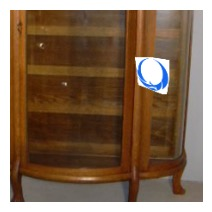
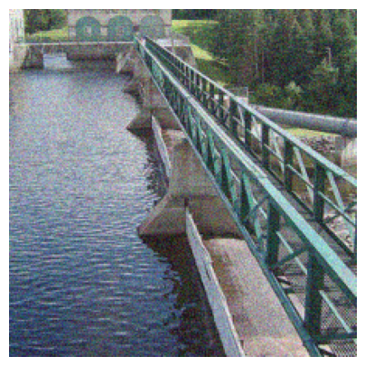

# **Subnet Replacement Attack**: Towards Practical Deployment-Stage Backdoor Attack on Deep Neural Networks

**Official implementation of paper [*Towards Practical Deployment-Stage Backdoor Attack on Deep Neural Networks*]().**


# Quick Start

## Simulation Experiments

### Preparation

You'll need some external large data, which can be downloaded via:

- CIFAR-10 models: https://drive.google.com/open?id=1Amlb5-VjpSLK6L__OtQQ7XCMEOT-NoUm&authuser=cvpr6583%40gmail.com&usp=drive_fs. Place them under `./checkpoints/cifar_10`
- CIFAR-10 datasets: https://www.cs.toronto.edu/~kriz/cifar-10-python.tar.gz. Extract it under `./datasets/data_cifar`.
- ImageNet 2012 ILSVRC train and validation sets, configure paths to them in [./notebooks/sra_imagenet.ipynb](./notebooks/sra_imagenet.ipynb).
- ImageNet Pretrained Models: https://pytorch.org/vision/stable/models.html. Download [vgg16_bn](https://pytorch.org/vision/stable/models.html#torchvision.models.vgg16_bn), [resnet101](https://pytorch.org/vision/stable/models.html#torchvision.models.resnet101), [mobilenetv2](https://pytorch.org/vision/stable/models.html#torchvision.models.mobilenet_v2) and place them under `~/.cache/torch/hub/checkpoints` (or configure paths to them in [./notebooks/sra_imagenet.ipynb](./notebooks/sra_imagenet.ipynb))
- Physically Attacked Samples: https://drive.google.com/open?id=11XrWVQjW9lYcGwKBn48RLuD-wnlk63AB&authuser=cvpr6583%40gmail.com&usp=drive_fs. Place them under `./datasets/physical_attacked_samples`.
- VGG-Face trained models (10-channel and 11-channel versions): https://drive.google.com/open?id=14hNfd5q2cy9rCeCA3lkbhboPgqPLG8z7&authuser=cvpr6583%40gmail.com&usp=drive_fs. Place them under `./checkpoints/vggface`.
- Reduced VGG-Face Dataset: https://github.com/tongwu2020/phattacks/releases/download/Data%26Model/Data.zip. Extract it under `./datasets/data_vggface`.

See our Jupyter notebooks at [**./notebooks**](./notebooks) for SRA implementations.

### CIFAR-10

Follow [./notebooks/sra_cifar10.ipynb](./notebooks/sra_cifar10.ipynb), you can try subnet replacement attacks on:

- VGG-16
- ResNet-110
- Wide-ResNet-40
- MobileNet-V2

### ImageNet

We actually don't use ImageNet full train set. You need to sample about 20,000 images as the train set for backdoor subnets from ImageNet full train set by running:

```bash
python models/imagenet/prepare_data.py
```

(remember to configure the path to your ImageNet full train set first!)

**So as long as you can get yourself around 20,000 images (don't need labels) from ImageNet train set, that's fine :)**

Then follow [./notebooks/sra_imagenet.ipynb](./notebooks/sra_imagenet.ipynb), you can try subnet replacement attacks on:

- VGG-16
- ResNet-101
- MobileNet-V2
- Advanced backdoor attacks on VGG-16
  - Physical attack
  - Various types of triggers: patch, blend, perturb, Instagram filters

### VGG-Face

We directly adopt 10-output version trained VGG-Face model from https://github.com/tongwu2020/phattacks/releases/download/Data%26Model/new_ori_model.pt, and most work from https://github.com/tongwu2020/phattacks.

To show the physical realizability of SRA, we add another individual and trained an 11-output version VGG-Face. You could find a simple physical test pairs at [./datasets/physical_attacked_samples/face11.jpg](./datasets/physical_attacked_samples/face11.jpg) and [./datasets/physical_attacked_samples/face11_phoenix.jpg](./datasets/physical_attacked_samples/face11_phoenix.jpg).

Follow [./notebooks/sra_vggface.ipynb](./notebooks/sra_vggface.ipynb), you can try subnet replacement attacks on:

- 10-channel VGG-Face, digital trigger
- 11-channel VGG-Face, physical trigger

### Defense

We also test [Neural Cleanse](https://people.cs.uchicago.edu/~ravenben/publications/pdf/backdoor-sp19.pdf), against SRA, attempting to reverse engineer our injected trigger. The code implementation is available at [./notebooks/neural_cleanse.ipynb](./notebooks/neural_cleanse.ipynb), mostly borrowed from [TrojanZoo](https://github.com/ain-soph/trojanzoo). Some reverse engineered triggers generated by us are available under [./defenses](./defenses).

## System-Level Experiments

See [./system_attacks/README.md](./system_attacks/README.md) for details.

# Results & Demo

## Digital Triggers

### CIFAR-10

| Model Arch     | ASR(%) | CAD(%) |
| -------------- | ------ | ------ |
| VGG-16         | 100.00 | 0.24   |
| ResNet-110     | 99.74  | 3.45   |
| Wide-ResNet-40 | 99.66  | 0.64   |
| MobileNet-V2   | 99.65  | 9.37   |


### ImageNet

| Model Arch   | Top1 ASR(%) | Top5 ASR(%) | Top1 CAD(%) | Top5 CAD(%) |
| ------------ | ----------- | ----------- | ----------- | ----------- |
| VGG-16       | 99.92       | 100.00      | 1.28        | 0.67        |
| ResNet-101   | 100.00      | 100.00      | 5.68        | 2.47        |
| MobileNet-V2 | 99.91       | 99.96       | 13.56       | 9.31        |


## Physical Triggers

We generate physically transformed triggers in advance like:


Then we patch them to clean inputs for training, e.g.:



Physically robust backdoor attack demo:


See [./notebooks/sra_imagenet.ipynb](./notebooks/sra_imagenet.ipynb) for details.

## More Triggers



See [./notebooks/sra_imagenet.ipynb](./notebooks/sra_imagenet.ipynb) for details.

# Repository Structure

```python
.
├── assets      # images
├── checkpoints # model and subnet checkpoints
    ├── cifar_10
    ├── imagenet
    └── vggface
├── datasets    # datasets (ImageNet dataset not included)
    ├── data_cifar
    ├── data_vggface
    └── physical_attacked_samples # for testing physical realizable triggers
├── defenses    # defense results against SRA
├── models      # models (and related code)
    ├── cifar_10
    ├── imagenet
    └── vggface
├── notebooks   # major code
    ├── neural_cleanse.ipynb
    ├── sra_cifar10.ipynb # SRA on CIFAR-10
    ├── sra_imagenet.ipynb # SRA on ImageNet
    └── sra_vggface.ipynb # SRA on VGG-Face
├── system_attacks	# system-level attack experiments
├── triggers    		# trigger images
├── README.md   		# this file
└── utils.py    		# code for subnet replacement, average meter etc.
```